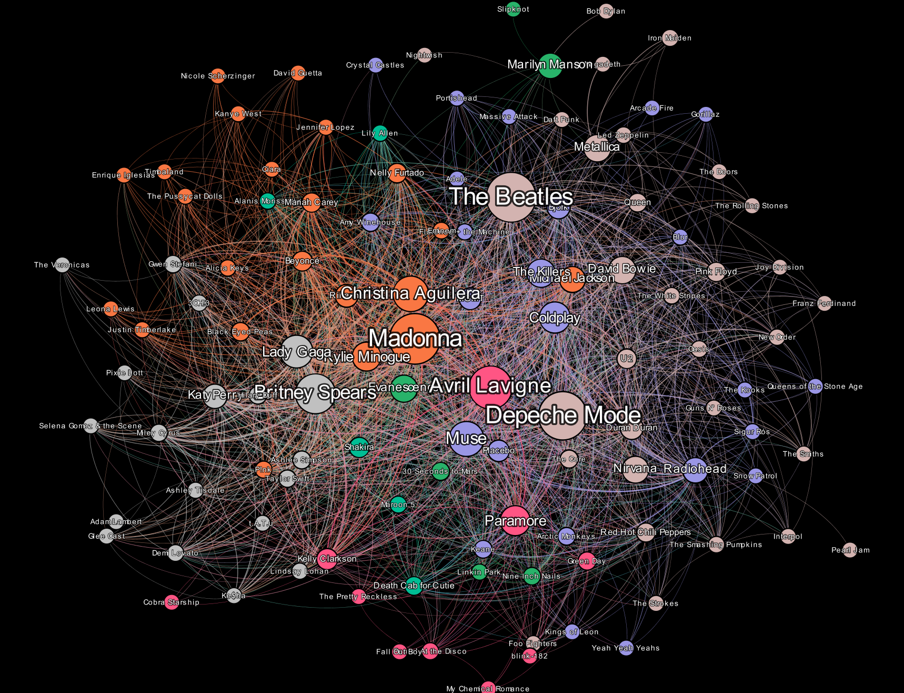
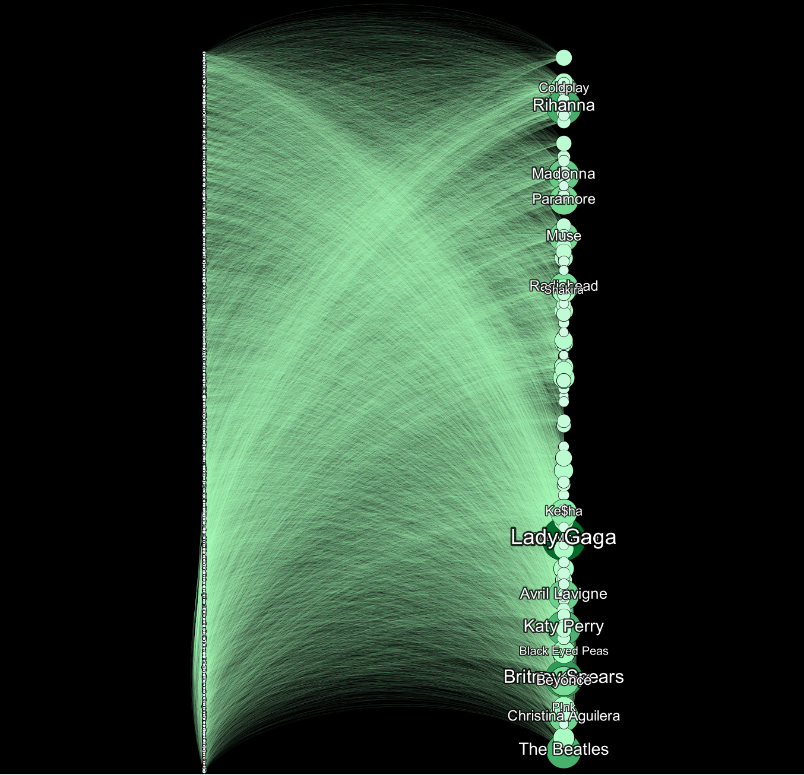
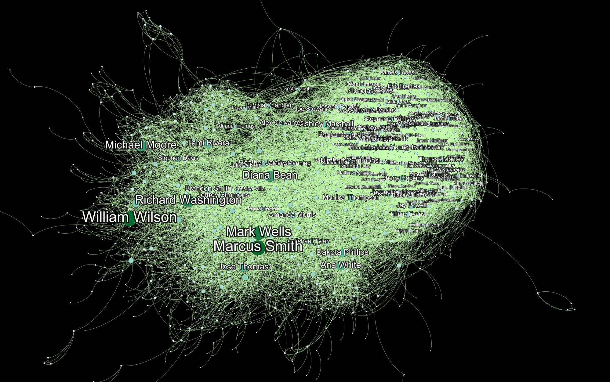

# Embedding for Heterogenous Networks

## Introduction
In this work, we plan to implement metapath2vec, a meta-path based representation learning technique that uses a modified skip-gram model to learn latent d-dimensional representation of nodes in a user-music heterogeneous interactions network. We will show that metapath2vec embedding can be used for heterogeneous network mining tasks like node classification, similarity search and it outperforms the traditional state of the art representation learning technique like Node2vec which is designed specifically for homogeneous networks.

## How-To
Open Terminal (Linux/Mac) or WSL (Windows). Make sure git and anaconda is installed
1. `git clone`
2. `cd `
3. `conda create -n env python=3.7`
4. ` conda activate env`
5. ` pip install -r requirements.txt`
6. `python -m ipykernel install --user --name env`
7. `jupyter-notebook`
8. Change kernel to env
## Future Work
1. Snake Make
2. 

## FAQ and Known Issues

## Contact
Please reach out to arsaikia@iu.edu for questions and feedback.